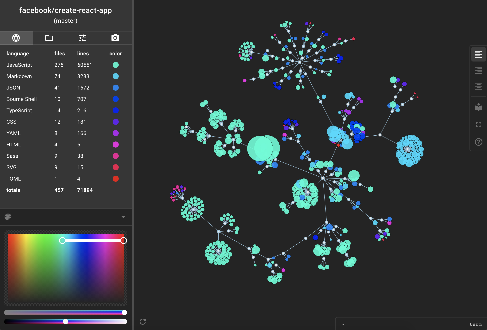
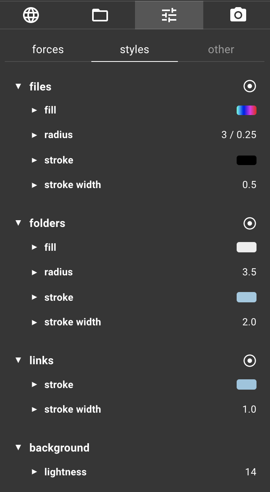
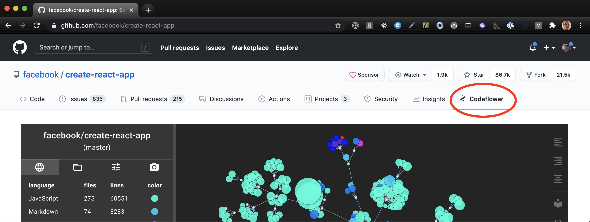

### Codeflower

It's a tool! Or maybe just a toy? Whatever you call it, the app visualizes git repositories. Here's one of [facebook/create-react-app](https://github.com/facebook/create-react-app):

### What is that?

On the left we've got a table listing all the languages in the repo, and the number of files and lines of each language. Each language has a unique color, and those colors are spaced evenly along a linear gradient. That gradient is determined by the picker on the lower left.

The colorful thing on the right is [d3 force-directed graph](https://github.com/d3/d3-force). The shape of the graph corresponds directly to the create-react-app's file tree. The outer (colored) nodes represent the files, and the inner (white) ones represent the folders. The color of each outer node indicates the language the file is written in. And the radius of the outer nodes reflects the number of lines of code in the corresponding files -- i.e. bigger nodes mean more lines of code.

You can interact with the viz in a number of ways:
  - use the mousewheel to zoom in and out
  - drag the dark part of the viz the move the whole thing around
  - drag an individual folder or file node to move it around
  - hover on a folder or file node to see its name
  - click on a file node to view the full text of the file
  - hover on a line in the table to suppress all files that are not in the language you're hovering on
  - use the gradient picker to change the colors assigned to the languages

### Customizing the viz

Almost everything about the visualization can be modified. If you click the settings tab in the sidebar you'll see a whole bunch of knobs and buttons and such:

  
  

These allow you to change the forces that generate the graph, and change all of the styling of the visualization. If you mess around with the settings (especially opacity and file radius) you can make some intriguing images:

  
  

  
  

### Where to find the app

#### 1. on the web

The app lives at [codeflower.la](https://codeflower.la). Enter a git clone url in the search field to visualize a repo.

You can skip the search field entirely by embedding the owner and name of the repo in the URL. For example,

[codeflower.la/?owner=facebook&name=create-react-app](codeflower.la/?owner=facebook&name=create-react-app)

will take you directly to the create-react-app visualization shown above. (Currently this option only works for Github-hosted repos.)

#### 2. as a browser extension

The app is also available as a extension for [chrome](https://chrome.google.com/webstore/detail/codeflower/mnlengnbfpfgcfdgfpkjekoaeophmmeh) and a [firefox](https://addons.mozilla.org/en-US/firefox/addon/codeflower/). If you install the browser extension, you can visualize repos inside Github with a single click:

### Limitations

The app uses SVG to render the visualization, which means that every file and folder is an individual DOM node. This creates a lot of work for the browser, and as the number of nodes grows larger you'll start to encounter performance problems. The optimal repo size seems to be between a couple of hundred nodes (large enough to be interesting) and 2500 or so (too large to render smoothly).

It's possible that a Canvas or Web-GL based solution would help with performance for large repos, but those solutions would also limit the interactivity of the visualization. Ideas are welcome!

### Credits

The app could not function at all without the `cloc` command-line tool ([AlDanial/cloc](https://github.com/AlDanial/cloc)), which does the hard work of (1) identifying the language of each file in a given repo, and (2) counting the number of lines of code in each file. `cloc` runs on the Node server after the repo has been cloned.

Also, [Fran&#231;ois Zaninotto](https://twitter.com/francoisz) was the first to notice that `cloc` output could be used to generate a force-directed graph, and he wrote the [original Codeflower visualization](https://github.com/fzaninotto/CodeFlower). This app mostly just adds some visual flourishes and a whole lot of automation to his idea.
